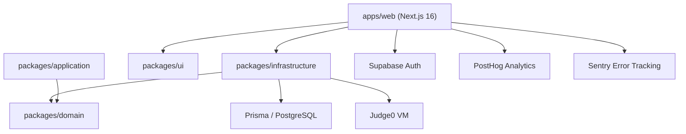
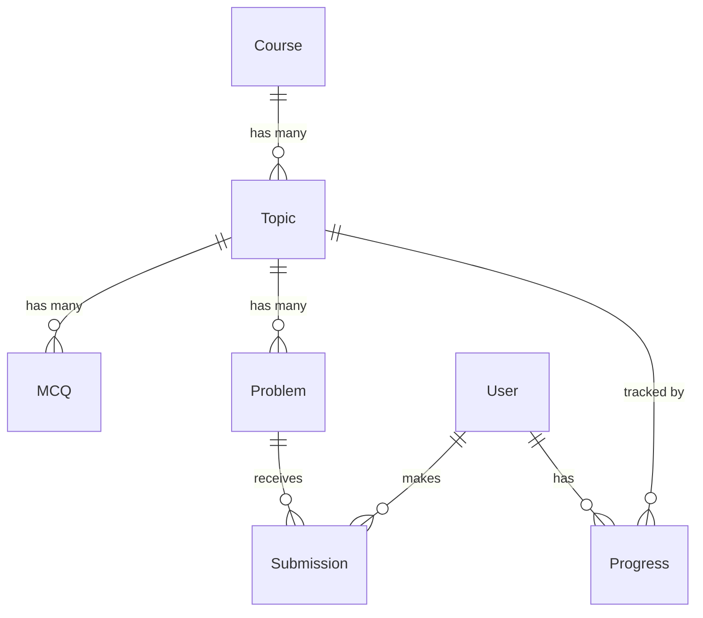

# CodeMaster EdTech — Complete Project Guide

> **One document to understand every file and feature in the codebase.**

---

## Table of Contents

1. [What is CodeMaster?](#1-what-is-codemaster)
2. [Architecture Overview](#2-architecture-overview)
3. [Monorepo Structure](#3-monorepo-structure)
4. [Root Configuration Files](#4-root-configuration-files)
5. [Shared Packages](#5-shared-packages)
6. [Web App — Configuration](#6-web-app--configuration)
7. [Web App — Pages & Routes](#7-web-app--pages--routes)
8. [Web App — Components](#8-web-app--components)
9. [Web App — Library Files](#9-web-app--library-files)
10. [Web App — API Routes](#10-web-app--api-routes)
11. [Web App — Data, Types & Workers](#11-web-app--data-types--workers)
12. [Database Schema](#12-database-schema)
13. [Feature Walkthroughs](#13-feature-walkthroughs)
14. [Environment Variables](#14-environment-variables)
15. [Key Commands](#15-key-commands)

---

## 1. What is CodeMaster?

CodeMaster is an **interactive coding education platform** for students aged 10 to university level. Students learn by:

1. **Reading concepts** (HTML-rendered lesson content)
2. **Answering MCQs** (interactive quizzes with instant feedback)
3. **Solving coding problems** (with a real code editor + Judge0 execution engine)

The platform also supports **schools** (B2B) with CSV-based bulk student import and DPDP Act 2023 parental consent compliance.

---

## 2. Architecture Overview



**Clean Architecture layers** (dependency flows inward):
- **Domain** — Pure TypeScript interfaces (`Topic`, `MCQ`, `Problem`, `Progress`). Zero dependencies.
- **Application** — Use cases with business logic (`GetDashboardUseCase`, `UpdateStreakUseCase`). Depends only on Domain.
- **Infrastructure** — Concrete implementations (Prisma ORM, Judge0 client, repositories). Depends on Domain.
- **Web App** — Next.js frontend that ties everything together.

---

## 3. Monorepo Structure

```
code-master-edtech/
├── .env                          # Root env vars (DATABASE_URL)
├── package.json                  # Root scripts via Turborepo
├── pnpm-workspace.yaml           # Workspace declaration
├── turbo.json                    # Task pipeline config
├── apps/
│   └── web/                      # Main Next.js app
│       ├── app/                   #   Pages & API routes
│       ├── components/            #   React components
│       ├── lib/                   #   Utility modules
│       ├── data/                  #   Seed data
│       ├── types/                 #   TypeScript types
│       ├── worker/                #   Service worker (PWA)
│       └── public/                #   Static assets
└── packages/
    ├── domain/                   # Pure business types
    ├── application/              # Use case classes
    ├── infrastructure/           # Prisma, Judge0, repositories
    ├── ui/                       # Shared UI components
    ├── eslint-config/            # Shared lint rules
    ├── tailwind-config/          # Shared CSS theme
    └── typescript-config/        # Shared tsconfig presets
```

---

## 4. Root Configuration Files

| File | Purpose |
|------|---------|
| [package.json](file:///Users/saivardhanpolampalli/Downloads/code-master-edtech/package.json) | Monorepo scripts (`build`, `dev`, `lint`) delegating to Turborepo. Shared deps: `turbo`, `prettier`, `pg`. |
| [pnpm-workspace.yaml](file:///Users/saivardhanpolampalli/Downloads/code-master-edtech/pnpm-workspace.yaml) | Declares `apps/*` and `packages/*` as workspaces for `workspace:*` linking. |
| [turbo.json](file:///Users/saivardhanpolampalli/Downloads/code-master-edtech/turbo.json) | Task pipeline: build depends on `^build`, dev is persistent/uncached. `globalEnv` lists all env vars. |

---

## 5. Shared Packages

### packages/domain/ — Business Types

| File | What It Defines |
|------|----------------|
| [entities.ts](file:///Users/saivardhanpolampalli/Downloads/code-master-edtech/packages/domain/entities.ts) | `Topic`, `MCQ`, `Problem`, `Submission`, `Progress` — pure interfaces, zero deps |

### packages/application/ — Use Cases

| File | Purpose |
|------|---------|
| [GetTopicUseCase.ts](file:///Users/saivardhanpolampalli/Downloads/code-master-edtech/packages/application/use-cases/GetTopicUseCase.ts) | Fetches topic + MCQs + problems from injected repository |
| [GetDashboardUseCase.ts](file:///Users/saivardhanpolampalli/Downloads/code-master-edtech/packages/application/use-cases/GetDashboardUseCase.ts) | Aggregates streak, per-topic progress, and badges for a user |
| [SubmitCodeUseCase.ts](file:///Users/saivardhanpolampalli/Downloads/code-master-edtech/packages/application/use-cases/SubmitCodeUseCase.ts) | Creates submission → sends to Judge0 → saves result |
| [UpdateStreakUseCase.ts](file:///Users/saivardhanpolampalli/Downloads/code-master-edtech/packages/application/use-cases/UpdateStreakUseCase.ts) | Streak logic: same day = keep, yesterday = +1, 2+ day gap = reset to 1 |

> **Note**: Use cases are not yet imported by the web app. MVP uses localStorage. Will be wired in Phase 3.

### packages/infrastructure/ — Database & Services

| File | Purpose |
|------|---------|
| [schema.prisma](file:///Users/saivardhanpolampalli/Downloads/code-master-edtech/packages/infrastructure/prisma/schema.prisma) | Complete DB schema (User, Course, Topic, MCQ, Problem, Progress, Submission) |
| [prisma.config.ts](file:///Users/saivardhanpolampalli/Downloads/code-master-edtech/packages/infrastructure/prisma.config.ts) | Loads root `.env`, configures Prisma's database URL |
| [src/index.ts](file:///Users/saivardhanpolampalli/Downloads/code-master-edtech/packages/infrastructure/src/index.ts) | Re-exports `PrismaClient` and model types |
| [judge0.ts](file:///Users/saivardhanpolampalli/Downloads/code-master-edtech/packages/infrastructure/judge0.ts) | HTTP client for Judge0 code execution |
| [TopicRepository.ts](file:///Users/saivardhanpolampalli/Downloads/code-master-edtech/packages/infrastructure/repositories/TopicRepository.ts) | Placeholder repository (throws — not yet wired to Supabase) |

### packages/eslint-config/ — Lint Rules

| File | Purpose |
|------|---------|
| [base.js](file:///Users/saivardhanpolampalli/Downloads/code-master-edtech/packages/eslint-config/base.js) | Core: ESLint recommended + TypeScript + Prettier + Turbo |
| [next.js](file:///Users/saivardhanpolampalli/Downloads/code-master-edtech/packages/eslint-config/next.js) | Extends base with Next.js rules (React hooks, core web vitals) |
| [react-internal.js](file:///Users/saivardhanpolampalli/Downloads/code-master-edtech/packages/eslint-config/react-internal.js) | For internal React packages (packages/ui) |

### packages/tailwind-config/

| File | Purpose |
|------|---------|
| [shared-styles.css](file:///Users/saivardhanpolampalli/Downloads/code-master-edtech/packages/tailwind-config/shared-styles.css) | Imports Tailwind + custom brand colors (`blue-1000`, `purple-1000`, `red-1000`) |

### packages/typescript-config/

| File | Used By |
|------|---------|
| [base.json](file:///Users/saivardhanpolampalli/Downloads/code-master-edtech/packages/typescript-config/base.json) | All packages (strict, ES2022, NodeNext) |
| [nextjs.json](file:///Users/saivardhanpolampalli/Downloads/code-master-edtech/packages/typescript-config/nextjs.json) | apps/web (Bundler resolution, JSX preserve) |
| [react-library.json](file:///Users/saivardhanpolampalli/Downloads/code-master-edtech/packages/typescript-config/react-library.json) | packages/ui (react-jsx) |

---

## 6. Web App — Configuration

| File | Purpose |
|------|---------|
| [package.json](file:///Users/saivardhanpolampalli/Downloads/code-master-edtech/apps/web/package.json) | Dev on port 3001. Key deps: Next.js 16, React 19, Supabase, Monaco, CodeMirror, Sentry, PostHog, Prisma |
| [next.config.ts](file:///Users/saivardhanpolampalli/Downloads/code-master-edtech/apps/web/next.config.ts) | React strict mode + Sentry wrapper + PWA wrapper + Turbopack root config |
| [tsconfig.json](file:///Users/saivardhanpolampalli/Downloads/code-master-edtech/apps/web/tsconfig.json) | Extends nextjs.json, adds `@/*` path alias, enables strictNullChecks |
| [eslint.config.js](file:///Users/saivardhanpolampalli/Downloads/code-master-edtech/apps/web/eslint.config.js) | Re-exports shared Next.js ESLint config |
| [postcss.config.js](file:///Users/saivardhanpolampalli/Downloads/code-master-edtech/apps/web/postcss.config.js) | Processes CSS through `@tailwindcss/postcss` |
| [globals.css](file:///Users/saivardhanpolampalli/Downloads/code-master-edtech/apps/web/app/globals.css) | Imports Tailwind + shared styles, defines `streakPulse` animation |
| [sentry.client.config.ts](file:///Users/saivardhanpolampalli/Downloads/code-master-edtech/apps/web/sentry.client.config.ts) | Browser-side Sentry init (100% traces in dev, 20% in prod) |
| [sentry.server.config.ts](file:///Users/saivardhanpolampalli/Downloads/code-master-edtech/apps/web/sentry.server.config.ts) | Server-side Sentry init for API routes and SSR |
| [manifest.json](file:///Users/saivardhanpolampalli/Downloads/code-master-edtech/apps/web/public/manifest.json) | PWA manifest: app name, icons, standalone display mode |

---

## 7. Web App — Pages & Routes

### Route Map

| Route | Type | File |
|-------|------|------|
| `/` | Server | [app/page.tsx](file:///Users/saivardhanpolampalli/Downloads/code-master-edtech/apps/web/app/page.tsx) — Landing page |
| `/auth` | Server | [app/auth/page.tsx](file:///Users/saivardhanpolampalli/Downloads/code-master-edtech/apps/web/app/auth/page.tsx) — Auth form |
| `/home` | Server | [app/home/page.tsx](file:///Users/saivardhanpolampalli/Downloads/code-master-edtech/apps/web/app/home/page.tsx) — Student dashboard |
| `/learn/[topicId]` | Server+Client | [page.tsx](file:///Users/saivardhanpolampalli/Downloads/code-master-edtech/apps/web/app/learn/%5BtopicId%5D/page.tsx) + [learn-client.tsx](file:///Users/saivardhanpolampalli/Downloads/code-master-edtech/apps/web/app/learn/%5BtopicId%5D/learn-client.tsx) |
| `/admin` | Server | [app/admin/page.tsx](file:///Users/saivardhanpolampalli/Downloads/code-master-edtech/apps/web/app/admin/page.tsx) — Admin home |
| `/admin/topics` | Server | [app/admin/topics/page.tsx](file:///Users/saivardhanpolampalli/Downloads/code-master-edtech/apps/web/app/admin/topics/page.tsx) |
| `/admin/user-data` | Server | [app/admin/user-data/page.tsx](file:///Users/saivardhanpolampalli/Downloads/code-master-edtech/apps/web/app/admin/user-data/page.tsx) |
| `/admin/user-analysis` | Server | [app/admin/user-analysis/page.tsx](file:///Users/saivardhanpolampalli/Downloads/code-master-edtech/apps/web/app/admin/user-analysis/page.tsx) |
| `/school/dashboard` | Server+Client | [page.tsx](file:///Users/saivardhanpolampalli/Downloads/code-master-edtech/apps/web/app/school/dashboard/page.tsx) + [csv-upload-client.tsx](file:///Users/saivardhanpolampalli/Downloads/code-master-edtech/apps/web/app/school/dashboard/csv-upload-client.tsx) |

### Key Pages Explained

- **Landing Page (`/`)** — Hero with gradient text, animated badge, desktop/mobile screenshots, school B2B section, footer
- **Auth Page (`/auth`)** — Multi-method: Email+Password, Google OAuth, Phone OTP. Admin interceptor redirects admin email to `/admin`
- **Dashboard (`/home`)** — StreakCard, TopicProgress, BadgeDisplay, CourseCard. Data from localStorage (MVP)
- **Learn Page (`/learn/[topicId]`)** — 3 tabs: Concept (HTML), MCQs (quiz), Problems (code editor + execution)
- **Admin (`/admin/*`)** — Protected by cookie-based auth. Sidebar layout with placeholder management pages

---

## 8. Web App — Components

### Providers

| Component | File | Purpose |
|-----------|------|---------|
| AuthProvider | [auth-provider.tsx](file:///Users/saivardhanpolampalli/Downloads/code-master-edtech/apps/web/components/providers/auth-provider.tsx) | Listens to Supabase auth changes, redirects on SIGNED_IN |
| AnalyticsProvider | [analytics-provider.tsx](file:///Users/saivardhanpolampalli/Downloads/code-master-edtech/apps/web/components/providers/analytics-provider.tsx) | Initializes PostHog on mount |

### Dashboard Components

| Component | File | Purpose |
|-----------|------|---------|
| DashboardNav | [dashboard-nav.tsx](file:///Users/saivardhanpolampalli/Downloads/code-master-edtech/apps/web/components/dashboard-nav.tsx) | Top nav with logo + logout button |
| DashboardContent | [dashboard-content.tsx](file:///Users/saivardhanpolampalli/Downloads/code-master-edtech/apps/web/components/dashboard-content.tsx) | Full dashboard grid (streak, progress, badges, courses) |
| StreakCard | [streak-card.tsx](file:///Users/saivardhanpolampalli/Downloads/code-master-edtech/apps/web/components/streak-card.tsx) | Glassmorphism card with animated flame + streak count |
| TopicProgress | [topic-progress.tsx](file:///Users/saivardhanpolampalli/Downloads/code-master-edtech/apps/web/components/topic-progress.tsx) | Progress bar with gradient fill + solved/total |
| BadgeDisplay | [badge-display.tsx](file:///Users/saivardhanpolampalli/Downloads/code-master-edtech/apps/web/components/badge-display.tsx) | Earned (🏆 gold glow) and locked (🔒) badges grid |
| CourseCard | [course-card.tsx](file:///Users/saivardhanpolampalli/Downloads/code-master-edtech/apps/web/components/course-card.tsx) | Premium card with glow, progress bar, "Resume Learning" link |

### Auth & UI Primitives

| Component | File | Purpose |
|-----------|------|---------|
| AuthForm | [AuthForm.tsx](file:///Users/saivardhanpolampalli/Downloads/code-master-edtech/apps/web/components/AuthForm.tsx) | Multi-method auth (email, Google, phone OTP) |
| Button | [button.tsx](file:///Users/saivardhanpolampalli/Downloads/code-master-edtech/apps/web/components/ui/button.tsx) | Polymorphic button with 6 variants (shadcn/ui + CVA) |
| Skeleton | [skeleton.tsx](file:///Users/saivardhanpolampalli/Downloads/code-master-edtech/apps/web/components/ui/skeleton.tsx) | Loading placeholder |
| Tabs | [tabs.tsx](file:///Users/saivardhanpolampalli/Downloads/code-master-edtech/apps/web/components/ui/tabs.tsx) | Accessible tabs (Radix UI) |

---

## 9. Web App — Library Files

| File | Purpose |
|------|---------|
| [supabase.ts](file:///Users/saivardhanpolampalli/Downloads/code-master-edtech/apps/web/lib/supabase.ts) | Browser-side Supabase client (cookie-based auth via `@supabase/ssr`) |
| [prisma.ts](file:///Users/saivardhanpolampalli/Downloads/code-master-edtech/apps/web/lib/prisma.ts) | Singleton PrismaClient (global object pattern prevents connection exhaustion) |
| [admin-auth.ts](file:///Users/saivardhanpolampalli/Downloads/code-master-edtech/apps/web/lib/admin-auth.ts) | Server actions: `loginAdmin`, `logoutAdmin`, `verifyAdminAccess` (HTTP-only cookies) |
| [posthog.ts](file:///Users/saivardhanpolampalli/Downloads/code-master-edtech/apps/web/lib/posthog.ts) | PostHog init (autocapture disabled for children's privacy) |
| [utils.ts](file:///Users/saivardhanpolampalli/Downloads/code-master-edtech/apps/web/lib/utils.ts) | `cn()` — merges Tailwind classes via clsx + tailwind-merge |

---

## 10. Web App — API Routes

| Route | Method | File | Purpose |
|-------|--------|------|---------|
| `/api/execute` | POST | [route.ts](file:///Users/saivardhanpolampalli/Downloads/code-master-edtech/apps/web/app/api/execute/route.ts) | Proxies code to Judge0 VM, returns stdout/stderr |
| `/api/school/bulk-create` | POST | [route.ts](file:///Users/saivardhanpolampalli/Downloads/code-master-edtech/apps/web/app/api/school/bulk-create/route.ts) | Bulk creates student users from CSV data via Prisma |
| `/api/school/consent-report` | GET | [route.ts](file:///Users/saivardhanpolampalli/Downloads/code-master-edtech/apps/web/app/api/school/consent-report/route.ts) | Downloads DPDP consent CSV for a school |

---

## 11. Web App — Data, Types & Workers

| File | Purpose |
|------|---------|
| [python-loops.ts](file:///Users/saivardhanpolampalli/Downloads/code-master-edtech/apps/web/data/python-loops.ts) | Hardcoded seed: 1 topic, 3 MCQs, 3 problems (easy→medium→hard) |
| [learn.ts](file:///Users/saivardhanpolampalli/Downloads/code-master-edtech/apps/web/types/learn.ts) | Local types: Topic, MCQ, Problem, ExecutionResult, Progress, DashboardData |
| [worker/index.js](file:///Users/saivardhanpolampalli/Downloads/code-master-edtech/apps/web/worker/index.js) | PWA service worker with stale-while-revalidate caching for lessons |

---

## 12. Database Schema

Six models in [schema.prisma](file:///Users/saivardhanpolampalli/Downloads/code-master-edtech/packages/infrastructure/prisma/schema.prisma):



| Model | Key Fields | Purpose |
|-------|-----------|---------|
| **User** | email, age, isMinor, parentalConsent, role, schoolId | Users with DPDP compliance |
| **Course** | name, slug, language, isPublished | Course container |
| **Topic** | courseId, title, conceptHtml, videoUrl | Learning unit |
| **MCQ** | topicId, question, options (JSON), correctIndex | Quiz questions |
| **Problem** | topicId, starterCode, difficulty, testCases (JSON) | Coding challenges |
| **Progress** | userId, topicId, streak, longestStreak, isTopicComplete | Per-user tracking |
| **Submission** | userId, problemId, sourceCode, status, stdout | Code submissions |

---

## 13. Feature Walkthroughs

### Authentication
```
/auth → Email+Password | Google OAuth | Phone OTP
     → Admin email intercepted → loginAdmin() → /admin
     → Normal user → Supabase auth → AuthProvider → /home
```

### Learning
```
/home → CourseCard "Resume Learning" → /learn/python-loops
     → [Concept] Read HTML + video
     → [MCQs] Answer 3 questions → green/red + explanation
     → [Problems] Code editor → Run Code → /api/execute → Judge0 → output
```

### Streak System
```
Dashboard load → read localStorage → compare dates
  Same day = keep | Yesterday = +1 | 2+ days = reset to 1
  Update longestStreak → save → display in StreakCard
```

### School Dashboard
```
/school/dashboard → Supabase auth check
  Upload CSV → parse client-side → POST /api/school/bulk-create → Prisma
  Download report → GET /api/school/consent-report → CSV file
```

---

## 14. Environment Variables

| Variable | Location | Purpose |
|----------|----------|---------|
| `DATABASE_URL` | Root `.env` | PostgreSQL connection |
| `NEXT_PUBLIC_SUPABASE_URL` | `apps/web/.env.local` | Supabase project URL |
| `NEXT_PUBLIC_SUPABASE_ANON_KEY` | `apps/web/.env.local` | Supabase anon key |
| `NEXT_PUBLIC_POSTHOG_KEY` | `apps/web/.env.local` | PostHog analytics |
| `NEXT_PUBLIC_SENTRY_DSN` | `apps/web/.env.local` | Sentry (browser) |
| `JUDGE0_URL` | `apps/web/.env.local` | Code execution VM |
| `ADMIN_PASSWORD` | `apps/web/.env.local` | Admin login password |
| `ADMIN_EMAIL` | `apps/web/.env.local` | Admin email |

---

## 15. Key Commands

```bash
pnpm install          # Install all dependencies
pnpm dev              # Start dev server (port 3001)
pnpm build            # Production build
pnpm lint             # Lint (zero warnings enforced)
pnpm check-types      # TypeScript type check
pnpm format           # Format with Prettier
```

> **Status**: MVP with hardcoded seed data + localStorage. Phase 3 will wire the full database pipeline.
